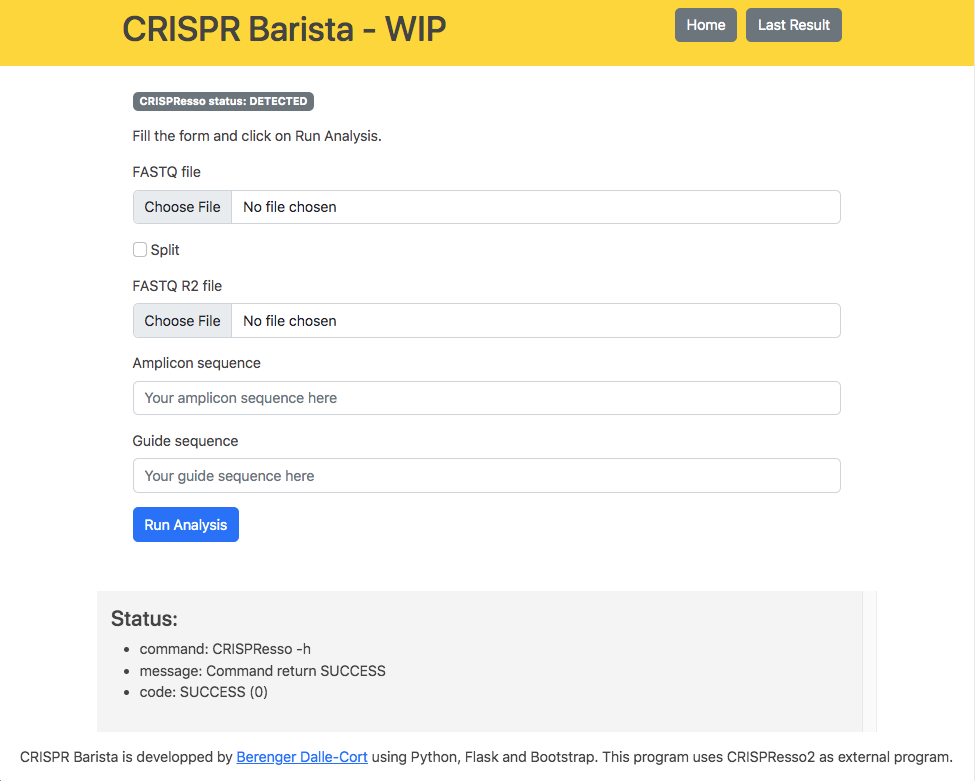
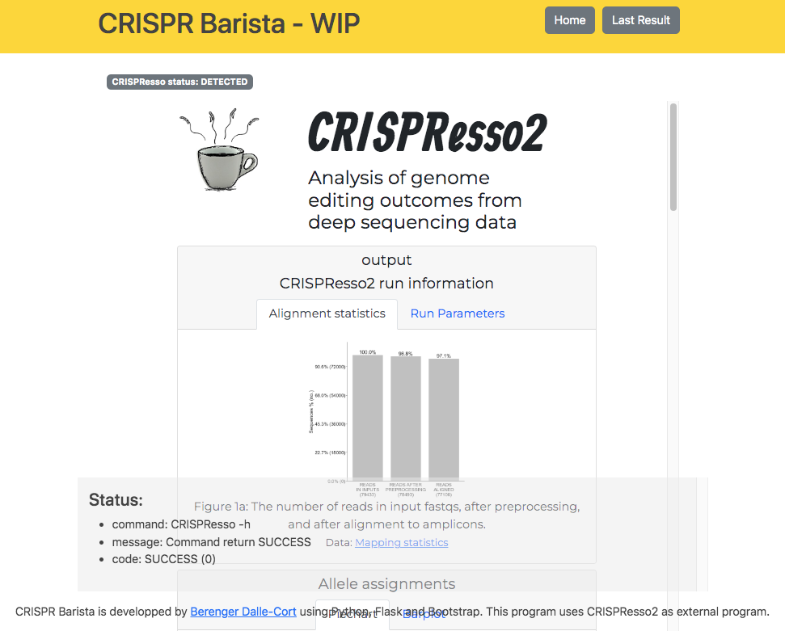

# CRISPR Barista

*CRISPR Barista* is a simple UI to drive your command line CRISPResso2 program.
The program uses Python3.7+, Flask and Boostrap.

## Prerequisites

[CRISPResso2](https://github.com/pinellolab/CRISPResso2) must be installed using [bioconda method](https://github.com/pinellolab/CRISPResso2#bioconda) (running `CRISPResso2 -h` must not fail).

Python3.7+ must be installed in a Unix-like operating system (MacOS or Linux).

## Limitations

Handle only those parameters: `--fastq_r1`, `--fastq_r2`, `--amplicon_seq` and `--guide_seq`

In case you have a single `fastq` file containing 2 reads, you can check `split`, the program will split the files for you.

## Usage

### `./install.sh`

Initialize a local environment and install dependencies.
Python3 is required.

### `./run.sh`

Launches the application.
Once you see `* Running on http://127.0.0.1:5000 (Press CTRL+C to quit)` open `http://127.0.0.1:5000` with your favorite browser.

*Warning: do not deploy in production, use only localy*

### `./dev.sh`

Launches the application in debug mode.

## Captures

  
Main interface

  
    
  
Result page

  

